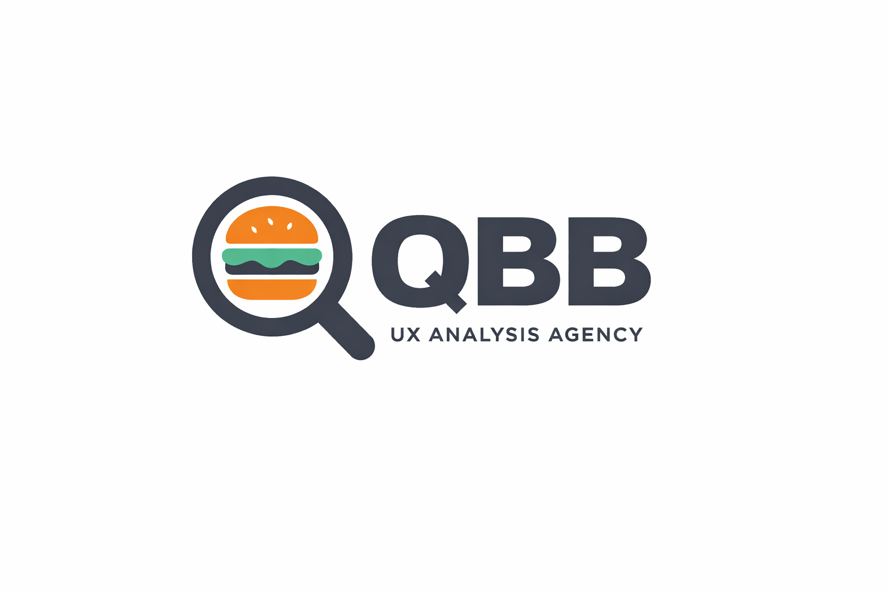

# DIU26
Prácticas Diseño Interfaces de Usuario (Tema: .... ) 

* [Guiones de prácticas](GuionesPracticas/)
* [Guía para crea tu Case Study](Guia_CaseStudy.md)
* Sala de la Fama [DIU Hall of fame](https://github.com/mgea/DIU/tree/master/hall_of_fame) donde se pueden encontrar Case Study destacados de otros años.

Actualizado: 14/01/2026

## Paso 0 My UX-Case Study

---

**Grupo:** DIU3_QBB. **Curso:** 2025/26  

**Nombre del Proyecto:** Goiko Experience: Optimización de la Carta y Flujos de Conversión

**Descripción:** Análisis y propuesta de mejora para la plataforma web de Goiko, enfocada en eliminar la frustración del usuario mediante una mejor jerarquía visual de ingredientes, transparencia en precios y accesibilidad tanto para clientes (B2C) como para colaboradores (B2B).

**Logotipo:**  

**Miembros y nombre del equipo:**

- :bust_in_silhouette: Manuel Gómez Rubio :octocat: [Enlace a GitHub]
- :bust_in_silhouette: Juan Manuel Jiménez Álvarez :octocat: [Enlace a GitHub]

---

 

# Proceso de Diseño

 

## Paso 1. UX User & Desk Research & Analisis

---

## 1.a User Research Plan

---

### User Research Plan: Goiko Experience

#### Contexto y Justificación

El proyecto seleccionado para la investigación es la plataforma web de Goiko, un referente en el sector de las hamburgueserías gourmet y la Fast Food experience. Como estudiantes universitarios somos usuarios habituales de servicios de restauración, delivery y reservas online. Esto nos permite acercarnos al contexto desde la perspectiva real del consumidor, pero aportando ahora una visión analítica, empática y crítica como diseñadores UX.

#### Objetivos de la Investigación

El objetivo principal de esta investigación es analizar la página web de Goiko para entender si resulta fácil e intuitiva para los usuarios. Queremos comprobar si acciones importantes, como reservar una mesa o consultar la carta, se pueden realizar de forma rápida y sin confusión.

También buscamos detectar posibles dificultades que puedan aparecer durante la navegación, especialmente cuando el usuario intenta encontrar información concreta, como los alérgenos o los detalles de los platos. Con esto pretendemos proponer mejoras que hagan la experiencia más cómoda, clara y accesible, tanto para el público joven como para familias que necesitan información fiable antes de elegir dónde comer.

#### Metodología y Estrategia

La estrategia se articulará combinando métodos cualitativos y analíticos. Iniciaremos con un Desk Research (análisis competitivo) frente a otras marcas del sector. Posteriormente, definiremos User Personas y Journey Maps para comprender las necesidades y frustraciones de distintos arquetipos de clientes. Finalmente, aplicaremos una Usability Review actuando como expertos para evaluar los principios heurísticos de la web, identificar problemas de usabilidad y proponer soluciones de alto valor.

* [📄 Ver Plan de Investigación (PDF)](P1/1.UserResearchPlan/UserResearchPlan.pdf)

---

## 1.b Competitive Analysis

### Desk Research: Competitive Analysis

#### Introducción y Justificación

Para el análisis competitivo dentro del sector de la Fast Food Experience en Granada, hemos elegido 2 páginas web de hamburgueserías locales muy relevantes:

**Gottan Grill:**  
Hamburguesería especializada en burgers gourmet con una propuesta moderna y muy cuidada. Destaca por una identidad visual atractiva y una presentación muy visual de sus productos, enfocada en transmitir calidad y una experiencia gastronómica urbana.

**Mostaza Green Burger:**  
Restaurante de hamburguesas gourmet con varios locales en Granada. Destaca por un enfoque de street food más "Fast Good", fresco y con opciones saludables y creativas (como la "Burger del Mes").

Hemos elegido estas páginas porque ofrecen productos y servicios muy similares a nuestro caso de estudio principal (Goiko). Cada una de ellas presenta elementos de la Interfaz de Usuario (UI) que se podrían haber aprovechado mejor en las demás. Por ejemplo, la identidad visual y el atractivo de Gottan Grill resulta muy llamativo frente a la de Mostaza Green, mientras que esta última estructura mejor su carta visible online. Por ello, realizar una comparativa técnica con estas dos páginas aportará información de gran relevancia a nuestra investigación.

### Criterios de Evaluación (Versión Mejorada para Fast Food)

Para comparar las 3 páginas, hemos valorado de 0 a 3 estrellas los siguientes criterios, divididos en áreas clave de experiencia de usuario y negocio:

#### 1. Atracción y Contenido Visual (Food Appeal)

- Atractivo visual de la carta: Calidad de fotografías, uso de vídeos y redacción persuasiva (copywriting) de los ingredientes. La interfaz debe "dar hambre".
- Actualizaciones y dinamismo: Visibilidad de novedades temporales (ej. "Burger del Mes", promociones) que inciten a la repetición.
- Identidad de marca y Marketing: Coherencia estética con el público joven y presencia de enlaces visibles y funcionales a redes sociales.

#### 2. Usabilidad y Flujos de Conversión

- Experiencia Mobile-First: Adaptación en dispositivos móviles y tamaño de los botones (CTAs) para ser pulsados cómodamente con el pulgar.
- Gestión de Reservas / Pedidos: Rapidez y ausencia de fricciones en el flujo principal. Claridad en el calendario de reservas o en el carrito.
- Personalización del pedido: Facilidad para añadir extras o quitar ingredientes viendo el precio actualizado en tiempo real.
- Venta cruzada (Cross-selling): Capacidad del sistema para sugerir complementos (bebidas, entrantes, postres) de forma natural antes de finalizar el pedido.

#### 3. Navegación y Accesibilidad

- Opciones de filtrado y búsqueda: Capacidad para filtrar la carta según necesidades dietéticas (opciones veganas, mapa de alérgenos claro, sin gluten).
- Accesibilidad Visual (WCAG): Contraste adecuado entre texto y fondo, tipografías legibles y uso de texto alternativo en las imágenes para lectores de pantalla.
- Contacto y Geolocalización: Visibilidad de horarios, teléfono y eficacia del mapa interactivo para encontrar los locales físicos.
- Soporte multilingüe: Posibilidad de cambiar el idioma de forma rápida, clave para el turismo en Granada.

#### 4. Rendimiento y Confianza

- Rendimiento de la web (Performance): Tiempos de carga rápidos, factor crítico dado el peso de las imágenes en alta resolución.
- Transparencia de precios: Claridad en los costes de envío, pedido mínimo e impuestos desde el inicio, evitando costes ocultos en el checkout.
- Retroalimentación (Feedback del sistema): Mensajes claros de confirmación al añadir un producto, confirmar una reserva o avisos descriptivos de error.
- Cuenta de usuario y Fidelización: Opciones para crear un perfil, guardar direcciones habituales, repetir pedidos o acumular puntos.

* [📊 Ver Análisis Competitivo (PDF)](P1/2.CompetitorAnalysis/CompetitorAnalysis.pdf)

---

## 1.c Personas
  

---

Hemos definido dos perfiles opuestos para cubrir todo el espectro de uso:

- **Mateo (El Organizador Foodie):** Representa al cliente final (B2C). Joven digital que necesita encontrar opciones veganas rápido y gestionar reservas grupales desde su móvil sin fricciones.
- **Carlos Mendieta (El Proveedor):** Representa el enfoque de negocio (B2B). Un gerente que busca contactar con la marca para proponer una colaboración y se frustra ante la falta de un canal corporativo claro.

### Justificación

Para esta práctica hemos definido perfiles de usuario que representan los dos grandes extremos del ecosistema digital en el sector de la Fast Food Experience.

Por un lado, abordamos el enfoque B2C (cliente final) con "El Organizador Foodie" (Mateo), un joven nativo digital que busca rapidez, estética, facilidad para gestionar reservas grupales desde su móvil y filtros claros para encontrar opciones dietéticas (como hamburguesas veganas) para sus amigos.

Por otro lado, exploramos la vertiente B2B (negocio a negocio) con Carlos Mendieta, gerente de “Mendieta Artisan Buns”, un empresario que busca contactar con la marca para proponer una colaboración como proveedor de panes artesanos.

Analizar ambos perfiles nos permite evaluar la interfaz de forma integral: no solo comprobando la usabilidad del motor de reservas y la claridad visual de la carta (opciones veganas y alérgenos), sino también auditando la accesibilidad corporativa, la visibilidad de los formularios de contacto y la transparencia de la marca para posibles partners.

* [👤 Ver Justificación de Personas (PDF)](P1/3.Personas/Justificaci%C3%B3n.pdf)
---

## 1.d User Journey Map
  

---

Hemos mapeado dos experiencias comunes pero problemáticas:

1. **Mateo** intentando reservar con amigos: Se evidencia la frustración al no poder filtrar la carta por alérgenos y las dificultades de uso del calendario en pantallas táctiles.  
2. **Carlos** buscando una alianza comercial: Su viaje termina en abandono al verse obligado a usar un canal de incidencias de clientes, lo que proyecta una imagen de marca hermética e informal.

### Justificación

Hemos elegido estos dos casos de estudio para evaluar la experiencia de usuario en dos de los flujos de interacción más críticos de la plataforma: la gestión de reservas físicas condicionada por restricciones dietéticas (enfoque B2C) y la búsqueda de canales de colaboración corporativa (enfoque B2B).

Además, queríamos evidenciar la fricción y las barreras de accesibilidad que hemos detectado al intentar completar estas tareas.

En el caso del consumidor final (Mateo), lo más destacable es la falta de filtros rápidos en la carta para encontrar opciones veganas y lo poco intuitivo que resulta manejar el widget del calendario o los formularios desde la versión móvil.

Por su parte, en el perfil de proveedor (Carlos Mendieta), destaca la ausencia de un área de "Partners" o colaboradores. Esta carencia obliga al profesional a recurrir al footer al apartado de atención al cliente (formulario y WhatsApp) diseñados exclusivamente para incidencias del cliente final.

Al centrar el contacto solo en la posventa, se ignora la intención de negocio del socio estratégico, generando una fricción crítica que proyecta una imagen de marca hermética y resta toda confianza profesional a la propuesta de colaboración.

* [🗺️ Ver Journey Maps (PDF)](P1/4.JourneyMaps/Persona%20%26%20User%20JourneyMap.pdf)

---

## 1.e Usability Review

---

El objetivo es revisar la usabilidad de la web de Goiko mediante un análisis experto basado en principios heurísticos.

- **Enlace al documento:** [📊 Informe de Usabilidad (PDF)](P1/5.UsabilityReview/Usability-review-template%20-%20Usability%20scores.pdf)  
- **URL y Valoración numérica:** www.goiko.com — **71 / 100 (Buena)**

### Comentario sobre la revisión

**Puntos Fuertes:**

- Excelente "Food Appeal" (fotografía de producto).
- URL predecible.
- Identidad de marca muy sólida y reconocible.

**Puntos Débiles:**

- Falta de filtros por ingredientes/alérgenos.
- Precios ocultos en la vista general.
- El rendimiento web es mejorable debido al peso de las imágenes.
- Carencia crítica de feedback visual en los formularios de contacto y personalización de pedidos.

 

---

## 1.f Briefing

### Briefing

Como se indicó inicialmente en el Research Plan, nuestro objetivo principal era analizar y mejorar la experiencia de usuario en la plataforma web de Goiko, optimizando los flujos de conversión (reservas y consulta de carta) y haciendo la navegación más accesible tanto para el cliente final como para posibles colaboradores comerciales.

Para ello, iniciamos haciendo un análisis competitivo (Desk Research) con otras dos marcas locales relevantes: Gottan Grill y Mostaza Green Burger.

Concluimos que los competidores presentaban ciertas ventajas de diseño; por ejemplo, Gottan Grill lograba un mayor impacto visual en su identidad gráfica y un mejor rendimiento web con respecto a nuestra página principal.

Después, valoramos la experiencia de dos perfiles (B2C y B2B) con intereses totalmente distintos en el uso de la página.

Mateo, un joven organizador que buscaba reservar una mesa desde el móvil, se encontró con una falta de filtros rápidos para encontrar opciones veganas y un widget de reservas poco adaptado a pantallas táctiles.

Por su parte, Carlos, un empresario que intentaba contactar con la marca para ofrecerse como proveedor de panes artesanos, se frustró ante la total ausencia de un área corporativa o de "Partners", viéndose obligado a usar un canal de atención al cliente posventa que no proyectaba confianza profesional.

Finalizamos con una revisión de usabilidad (Usability Review), donde la plataforma obtuvo una puntuación global de 7 sobre 100 (Buena).

Comprobamos que la web destaca por un excelente atractivo visual de sus productos (food appeal) y una URL predecible con navegación sencilla.

Sin embargo, detectamos áreas de mejora críticas que interrumpen el flujo del usuario:

- La ausencia total de un buscador o filtros por ingredientes (lo que dificulta encontrar opciones específicas como comida vegana).
- La falta de precios visibles directamente en la vista general de la carta.
- Problemas de rendimiento con tiempos de carga lentos en imágenes de alta resolución.

Además, a nivel interactivo, la falta de señalización en las selecciones obligatorias al personalizar un pedido y la escasa visibilidad de las opciones de contacto corporativo (B2B) generan fricciones innecesarias.

En conclusión, la plataforma de Goiko posee una base sólida y un diseño que invita al consumo, pero requiere ajustes estratégicos.

Es prioritario:

- Implementar un sistema de filtrado en la carta.
- Añadir transparencia mostrando los precios desde el primer nivel de navegación.
- Optimizar el peso de los archivos multimedia.
- Mejorar el feedback visual en los formularios de pedido.

Con estas mejoras, la web lograría una experiencia de usuario (UX) sobresaliente, intuitiva y accesible para todos sus perfiles de cliente.

## Paso 2. UX Design  

>>> Cualquier título puede ser adaptado. Recuerda borrar estos comentarios del template en tu documento

### 2.a Reframing / IDEACION: Feedback Capture Grid / EMpathy map 
 
----

>>> Comenta con un diagrama los aspectos más destacados a modo de conclusion de la práctica anterior. De qué carece la competencia?? Tu diagrama puede ser una figura subida a la carpeta P2/

 Interesante | Críticas     
| ------------- | -------
  Preguntas | Nuevas ideas
  
    
>>> Explica el Problema y plantea una hipótesis. Es decir, explica aquí qué 
>>> se plantea como "propuesta de valor" para un nuevo diseño de aplicación propio

### 2.b ScopeCanvas

----

>>> Propuesta de valor, pero ahora en vez de un texto es un ScopeCanvas que has subido a P2/ y enlazado desde aqui. Tambien vale una imagen miniatura del recurso.
>>> No olvides que tu propuesta ya tiene un nombre corto y puedes actualizar la cabecera de este archivo

### 2.b User Flow (task) analysis 
 
-----

>>> Definir "User Map" y "Task Flow" ... enlazar desde P2/ y describir brevemente

### 2.c IA: Sitemap + Labelling 
 
----

>>> Identificar términos para diálogo con usuario (evita el spanglish) y la arquitectura de la información. Es muy apropiado un diagrama tipo sitemap y una tabla que se ampliaría para llevar asociado la columna iconos (tanto para la web como para una app). 

Término | Significado     
| ------------- | -------
  Login  | acceder a plataforma

### 2.d Wireframes
 
-----

>>> Plantear el diseño del layout para Web/movil (organización y simulación). Describa la herramienta usada 

 

## Paso 3. Mi UX-Case Study (diseño)

>>> Cualquier título puede ser adaptado. Recuerda borrar estos comentarios del template en tu documento

### 3.a Moodboard

-----

>>> Diseño visual con una guía de estilos visual (moodboard) 
>>> Incluir Logotipo. Todos los recursos estarán subidos a la carpeta P3/
>>> Explique aqui la/s herramienta/s utilizada/s y el por qué de la resolución empleada. Reflexione ¿Se puede usar esta imagen como cabecera de Instagram, por ejemplo, o se necesitan otras?

### 3.b Landing Page
 
----

>>> Plantear el Landing Page del producto. Aplica estilos definidos en el moodboard

### 3.c Guidelines
 
----

>>> Estudio de Guidelines y explicación de los Patrones IU a usar 
>>> Es decir, tras documentarse, muestre las deciones tomadas sobre Patrones IU a usar para la fase siguiente de prototipado. 

### 3.d Mockup
 
----

>>> Consiste en tener un Layout en acción. Un Mockup es un prototipo HTML que permite simular tareas con estilo de IU seleccionado. Muy útil para compartir con stakeholders

 

## Paso 4. Pruebas de Evaluación 

### 4.a Reclutamiento de usuarios 

-----

>>> Breve descripción del caso asignado (llamado Caso-B) con enlace al repositorio Github
>>> Tabla y asignación de personas ficticias (o reales) a las pruebas. Exprese las ideas de posibles situaciones conflictivas de esa persona en las propuestas evaluadas. Mínimo 4 usuarios: asigne 2 al Caso A y 2 al caso B.

| Usuarios | Sexo/Edad     | Ocupación   |  Exp.TIC    | Personalidad | Plataforma | Caso
| ------------- | -------- | ----------- | ----------- | -----------  | ---------- | ----
| User1's name  | H / 18   | Estudiante  | Media       | Introvertido | Web.       | A 
| User2's name  | H / 18   | Estudiante  | Media       | Timido       | Web        | A 
| User3's name  | M / 35   | Abogado     | Baja        | Emocional    | móvil      | B 
| User4's name  | H / 18   | Estudiante  | Media       | Racional     | Web        | B 

### 4.b Diseño de las pruebas 
 
-----

>>> Planifique qué pruebas se van a desarrollar. ¿En qué consisten? ¿Se hará uso del checklist de la P1?

### 4.c Cuestionario SUS
 
----

>>> Como uno de los test para la prueba A/B testing, usaremos el **Cuestionario SUS** que permite valorar la satisfacción de cada usuario con el diseño utilizado (casos A o B). Para calcular la valoración numérica y la etiqueta linguistica resultante usamos la [hoja de cálculo](https://github.com/mgea/DIU19/blob/master/Cuestionario%20SUS%20DIU.xlsx). Previamente conozca en qué consiste la escala SUS y cómo se interpretan sus resultados
http://usabilitygeek.com/how-to-use-the-system-usability-scale-sus-to-evaluate-the-usability-of-your-website/)
Para más información, consultar aquí sobre la [metodología SUS](https://cui.unige.ch/isi/icle-wiki/_media/ipm:test-suschapt.pdf)
>>> Adjuntar en la carpeta P4/ el excel resultante y describa aquí la valoración personal de los resultados 

### 4.d A/B Testing
 
-----

>>> Los resultados de un A/B testing con 3 pruebas y 2 casos o alternativas daría como resultado una tabla de 3 filas y 2 columnas, además de un resultado agregado global. Especifique con claridad el resultado: qué caso es más usable, A o B?

### 4.e Aplicación del método Eye Tracking 

----

>>> Indica cómo se diseña el experimento y se reclutan los usuarios. Explica la herramienta / uso de gazerecorder.com u otra similar. Aplíquese únicamente al caso B.

  
>>> Cambiar esta img por una de vuestro experimento. El recurso deberá estar subido a la carpeta P4/  

>>> gazerecorder en versión de pruebas puede estar limitada a 3 usuarios para generar mapa de calor (crédito > 0 para que funcione) 

### 4.f Usability Report de B
 
-----

>>> Añadir report de usabilidad para práctica B (la de los compañeros) aportando resultados y valoración de cada debilidad de usabilidad. 
>>> Enlazar aqui con el archivo subido a P4/ que indica qué equipo evalua a qué otro equipo.

>>> Complementad el Case Study en su Paso 4 con una Valoración personal del equipo sobre esta tarea

 

## Paso 5. Exportación y Documentación 

### 5.a Exportación a HTML/React
 
----

>>> Breve descripción de esta tarea. Las evidencias de este paso quedan subidas a P5/

### 5.b Documentación con Storybook

----

>>> Breve descripción de esta tarea. Las evidencias de este paso quedan subidas a P5/

 

## Conclusiones finales & Valoración de las prácticas

>>> Opinión FINAL del proceso de desarrollo de diseño siguiendo metodología UX y valoración (positiva /negativa) de los resultados obtenidos. ¿Qué se puede mejorar? Recuerda que este tipo de texto se debe eliminar del template que se os proporciona 

