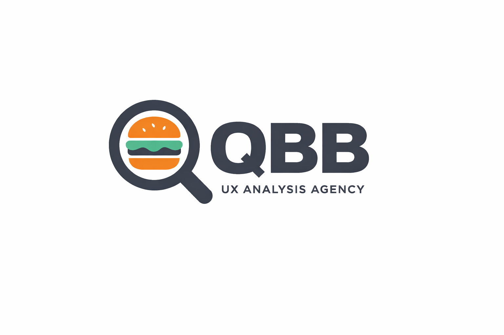
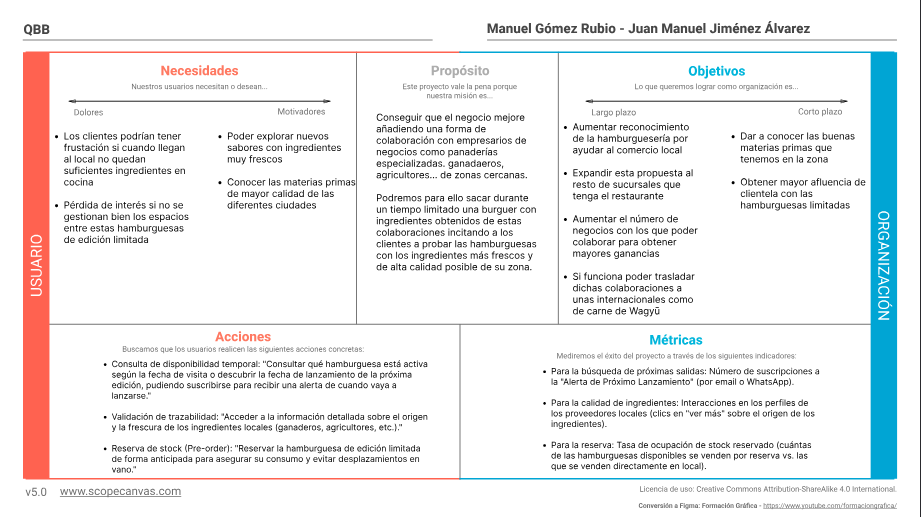

# DIU26
Prácticas Diseño Interfaces de Usuario (Tema: .... ) 

* [Guiones de prácticas](GuionesPracticas/)
* [Guía para crea tu Case Study](Guia_CaseStudy.md)
* Sala de la Fama [DIU Hall of fame](https://github.com/mgea/DIU/tree/master/hall_of_fame) donde se pueden encontrar Case Study destacados de otros años.
* [Práctica 3](./P3)
* Web Funcional: https://wide-lock-50038686.figma.site 


Actualizado: 14/01/2026


## Paso 0 My UX-Case Study


---

**Grupo:** DIU3_QBB. **Curso:** 2025/26  

**Nombre del Proyecto:** Goiko Experience: Optimización de la Carta y Flujos de Conversión

**Descripción:** Análisis y propuesta de mejora para la plataforma web de Goiko, enfocada en eliminar la frustración del usuario mediante una mejor jerarquía visual de ingredientes, transparencia en precios y accesibilidad tanto para clientes (B2C) como para colaboradores (B2B).

**Logotipo:**  


**Miembros y nombre del equipo:**

- :bust_in_silhouette: Manuel Gómez Rubio :octocat: [Enlace a GitHub]
- :bust_in_silhouette: Juan Manuel Jiménez Álvarez :octocat: [Enlace a GitHub]

---

<br>

# Proceso de Diseño

<br>

## Paso 1. UX User & Desk Research & Analisis

---

## 1.a User Research Plan

---

### User Research Plan: Goiko Experience

#### Contexto y Justificación

El proyecto seleccionado para la investigación es la plataforma web de Goiko, un referente en el sector de las hamburgueserías gourmet y la Fast Food experience. Como estudiantes universitarios somos usuarios habituales de servicios de restauración, delivery y reservas online. Esto nos permite acercarnos al contexto desde la perspectiva real del consumidor, pero aportando ahora una visión analítica, empática y crítica como diseñadores UX.

#### Objetivos de la Investigación

El objetivo principal de esta investigación es analizar la página web de Goiko para entender si resulta fácil e intuitiva para los usuarios. Queremos comprobar si acciones importantes, como reservar una mesa o consultar la carta, se pueden realizar de forma rápida y sin confusión.

También buscamos detectar posibles dificultades que puedan aparecer durante la navegación, especialmente cuando el usuario intenta encontrar información concreta, como los alérgenos o los detalles de los platos. Con esto pretendemos proponer mejoras que hagan la experiencia más cómoda, clara y accesible, tanto para el público joven como para familias que necesitan información fiable antes de elegir dónde comer.

#### Metodología y Estrategia

La estrategia se articulará combinando métodos cualitativos y analíticos. Iniciaremos con un Desk Research (análisis competitivo) frente a otras marcas del sector. Posteriormente, definiremos User Personas y Journey Maps para comprender las necesidades y frustraciones de distintos arquetipos de clientes. Finalmente, aplicaremos una Usability Review actuando como expertos para evaluar los principios heurísticos de la web, identificar problemas de usabilidad y proponer soluciones de alto valor.

* [📄 Ver Plan de Investigación (PDF)](P1/1.UserResearchPlan/UserResearchPlan.pdf)

---

## 1.b Competitive Analysis


### Desk Research: Competitive Analysis

#### Introducción y Justificación

Para el análisis competitivo dentro del sector de la Fast Food Experience en Granada, hemos elegido 2 páginas web de hamburgueserías locales muy relevantes:

**Gottan Grill:**  
Hamburguesería especializada en burgers gourmet con una propuesta moderna y muy cuidada. Destaca por una identidad visual atractiva y una presentación muy visual de sus productos, enfocada en transmitir calidad y una experiencia gastronómica urbana.

**Mostaza Green Burger:**  
Restaurante de hamburguesas gourmet con varios locales en Granada. Destaca por un enfoque de street food más "Fast Good", fresco y con opciones saludables y creativas (como la "Burger del Mes").

Hemos elegido estas páginas porque ofrecen productos y servicios muy similares a nuestro caso de estudio principal (Goiko). Cada una de ellas presenta elementos de la Interfaz de Usuario (UI) que se podrían haber aprovechado mejor en las demás. Por ejemplo, la identidad visual y el atractivo de Gottan Grill resulta muy llamativo frente a la de Mostaza Green, mientras que esta última estructura mejor su carta visible online. Por ello, realizar una comparativa técnica con estas dos páginas aportará información de gran relevancia a nuestra investigación.

### Criterios de Evaluación (Versión Mejorada para Fast Food)

Para comparar las 3 páginas, hemos valorado de 0 a 3 estrellas los siguientes criterios, divididos en áreas clave de experiencia de usuario y negocio:

#### 1. Atracción y Contenido Visual (Food Appeal)

- Atractivo visual de la carta: Calidad de fotografías, uso de vídeos y redacción persuasiva (copywriting) de los ingredientes. La interfaz debe "dar hambre".
- Actualizaciones y dinamismo: Visibilidad de novedades temporales (ej. "Burger del Mes", promociones) que inciten a la repetición.
- Identidad de marca y Marketing: Coherencia estética con el público joven y presencia de enlaces visibles y funcionales a redes sociales.

#### 2. Usabilidad y Flujos de Conversión

- Experiencia Mobile-First: Adaptación en dispositivos móviles y tamaño de los botones (CTAs) para ser pulsados cómodamente con el pulgar.
- Gestión de Reservas / Pedidos: Rapidez y ausencia de fricciones en el flujo principal. Claridad en el calendario de reservas o en el carrito.
- Personalización del pedido: Facilidad para añadir extras o quitar ingredientes viendo el precio actualizado en tiempo real.
- Venta cruzada (Cross-selling): Capacidad del sistema para sugerir complementos (bebidas, entrantes, postres) de forma natural antes de finalizar el pedido.

#### 3. Navegación y Accesibilidad

- Opciones de filtrado y búsqueda: Capacidad para filtrar la carta según necesidades dietéticas (opciones veganas, mapa de alérgenos claro, sin gluten).
- Accesibilidad Visual (WCAG): Contraste adecuado entre texto y fondo, tipografías legibles y uso de texto alternativo en las imágenes para lectores de pantalla.
- Contacto y Geolocalización: Visibilidad de horarios, teléfono y eficacia del mapa interactivo para encontrar los locales físicos.
- Soporte multilingüe: Posibilidad de cambiar el idioma de forma rápida, clave para el turismo en Granada.

#### 4. Rendimiento y Confianza

- Rendimiento de la web (Performance): Tiempos de carga rápidos, factor crítico dado el peso de las imágenes en alta resolución.
- Transparencia de precios: Claridad en los costes de envío, pedido mínimo e impuestos desde el inicio, evitando costes ocultos en el checkout.
- Retroalimentación (Feedback del sistema): Mensajes claros de confirmación al añadir un producto, confirmar una reserva o avisos descriptivos de error.
- Cuenta de usuario y Fidelización: Opciones para crear un perfil, guardar direcciones habituales, repetir pedidos o acumular puntos.

* [📊 Ver Análisis Competitivo (PDF)](P1/2.CompetitorAnalysis/CompetitorAnalysis.pdf)

---

## 1.c Personas
  


---

Hemos definido dos perfiles opuestos para cubrir todo el espectro de uso:

- **Mateo (El Organizador Foodie):** Representa al cliente final (B2C). Joven digital que necesita encontrar opciones veganas rápido y gestionar reservas grupales desde su móvil sin fricciones.
- **Carlos Mendieta (El Proveedor):** Representa el enfoque de negocio (B2B). Un gerente que busca contactar con la marca para proponer una colaboración y se frustra ante la falta de un canal corporativo claro.

### Justificación

Para esta práctica hemos definido perfiles de usuario que representan los dos grandes extremos del ecosistema digital en el sector de la Fast Food Experience.

Por un lado, abordamos el enfoque B2C (cliente final) con "El Organizador Foodie" (Mateo), un joven nativo digital que busca rapidez, estética, facilidad para gestionar reservas grupales desde su móvil y filtros claros para encontrar opciones dietéticas (como hamburguesas veganas) para sus amigos.

Por otro lado, exploramos la vertiente B2B (negocio a negocio) con Carlos Mendieta, gerente de “Mendieta Artisan Buns”, un empresario que busca contactar con la marca para proponer una colaboración como proveedor de panes artesanos.

Analizar ambos perfiles nos permite evaluar la interfaz de forma integral: no solo comprobando la usabilidad del motor de reservas y la claridad visual de la carta (opciones veganas y alérgenos), sino también auditando la accesibilidad corporativa, la visibilidad de los formularios de contacto y la transparencia de la marca para posibles partners.

* [👤 Ver Justificación de Personas (PDF)](P1/3.Personas/Justificaci%C3%B3n.pdf)
---

## 1.d User Journey Map
  


---

Hemos mapeado dos experiencias comunes pero problemáticas:

1. **Mateo** intentando reservar con amigos: Se evidencia la frustración al no poder filtrar la carta por alérgenos y las dificultades de uso del calendario en pantallas táctiles.  
2. **Carlos** buscando una alianza comercial: Su viaje termina en abandono al verse obligado a usar un canal de incidencias de clientes, lo que proyecta una imagen de marca hermética e informal.

### Justificación

Hemos elegido estos dos casos de estudio para evaluar la experiencia de usuario en dos de los flujos de interacción más críticos de la plataforma: la gestión de reservas físicas condicionada por restricciones dietéticas (enfoque B2C) y la búsqueda de canales de colaboración corporativa (enfoque B2B).

Además, queríamos evidenciar la fricción y las barreras de accesibilidad que hemos detectado al intentar completar estas tareas.

En el caso del consumidor final (Mateo), lo más destacable es la falta de filtros rápidos en la carta para encontrar opciones veganas y lo poco intuitivo que resulta manejar el widget del calendario o los formularios desde la versión móvil.

Por su parte, en el perfil de proveedor (Carlos Mendieta), destaca la ausencia de un área de "Partners" o colaboradores. Esta carencia obliga al profesional a recurrir al footer al apartado de atención al cliente (formulario y WhatsApp) diseñados exclusivamente para incidencias del cliente final.

Al centrar el contacto solo en la posventa, se ignora la intención de negocio del socio estratégico, generando una fricción crítica que proyecta una imagen de marca hermética y resta toda confianza profesional a la propuesta de colaboración.

* [🗺️ Ver Journey Maps (PDF)](P1/4.JourneyMaps/Persona%20%26%20User%20JourneyMap.pdf)

---

## 1.e Usability Review
---

El objetivo es revisar la usabilidad de la web de Goiko mediante un análisis experto basado en principios heurísticos y estándares de industria.

- **Enlace al documento:** [📊 Informe de Usabilidad (PDF)](P1/5.UsabilityReview/Usability-review-template%20-%20Usability%20scores.pdf)  
- **URL y Valoración numérica:** www.goiko.com — **63 / 100 (Moderada)**

### Comentario sobre la revisión

**Puntos Fuertes:**

- **Excelente "Food Appeal":** Gran calidad en la fotografía de producto que incentiva el consumo.
- **Identidad Visual:** Marca muy sólida, reconocible y consistente en términos de diseño.
- **Accesibilidad URL:** Dominio predecible y fácil de encontrar en buscadores.

**Puntos Débiles:**

- **Búsqueda y Filtrado Críticos:** Ausencia total de un buscador por ingredientes o filtros de dieta (vegana/alérgenos), calificada como **Muy Pobre**.
- **Arquitectura de Información:** El uso de "texto plano" oculta datos clave como precios e ingredientes, dificultando la escaneabilidad.
- **Navegación e Interacción:** El sistema no respeta estándares como el botón "atrás" del navegador en menús críticos y presenta errores de feedback en la gestión de permisos (ubicación).
- **Rendimiento Técnico:** Tiempos de carga elevados en imágenes de alta resolución que lastran la fluidez de la conversión.
- **Feedback en Formularios:** Falta de señalización clara en campos obligatorios y mensajes de error poco profesionales.
<br>

---

## 1.f Briefing

### Briefing
# Briefing

Como se indicó inicialmente en el Research Plan, nuestro objetivo principal era analizar y mejorar la experiencia de usuario en la plataforma web de Goiko, optimizando los flujos de conversión (reservas y consulta de carta) y haciendo la navegación más accesible tanto para el cliente final como para posibles colaboradores comerciales.

Para ello, iniciamos haciendo un análisis competitivo (Desk Research) con otras dos marcas locales relevantes: Gottan Grill y Mostaza Green Burger. Concluimos que los competidores presentaban ciertas ventajas de diseño; por ejemplo, Gottan Grill lograba un mayor impacto visual en su identidad gráfica y un mejor rendimiento web con respecto a nuestra página principal.

Después, valoramos la experiencia de dos perfiles (B2C y B2B) con intereses totalmente distintos en el uso de la página. Mateo, un joven organizador que buscaba reservar una mesa desde el móvil, se encontró con una falta de filtros rápidos para encontrar opciones veganas y un widget de reservas poco adaptado a pantallas táctiles. Por su parte, Carlos, un empresario que intentaba contactar con la marca para ofrecerse como proveedor de panes artesanos, se frustró ante la total ausencia de un área corporativa o de "Partners", viéndose obligado a usar un canal de atención al cliente posventa que no proyectaba confianza profesional.

Finalizamos con una Usability Review donde la plataforma obtuvo una puntuación de 63/100 (Moderada). Aunque destaca por su alto atractivo visual (food appeal) y una identidad de marca sólida, presenta fallos críticos en la arquitectura de información. La ausencia de buscadores y filtros por ingredientes (calificada como "Muy Pobre") obliga al usuario a una navegación manual ineficiente.

A nivel interactivo, detectamos fricciones severas: el uso de "texto plano" oculta información clave como precios e ingredientes, y el sistema de navegación no respeta los estándares del botón "atrás" del navegador. Además, la falta de feedback visual en errores de formulario y la carga lenta de imágenes de alta resolución lastran la conversión. En conclusión, la web es estéticamente potente pero funcionalmente limitada, requiriendo una optimización urgente en filtros, jerarquía de textos y rendimiento técnico para ser verdaderamente intuitiva.

En conclusión, la plataforma de Goiko posee una base sólida y un diseño que invita al consumo, pero requiere ajustes estratégicos. Es prioritario implementar un sistema de filtrado en la carta, añadir transparencia mostrando los precios desde el primer nivel de navegación, optimizar el peso de los archivos multimedia, mejorar el feedback visual en los formularios de pedido y algunas cosas más. Con estas mejoras, la web lograría una experiencia de usuario (UX) sobresaliente, intuitiva y accesible para todos sus perfiles de cliente.

## Prioridades de Optimización

Basado en el análisis de UX y la revisión de usabilidad, se han establecido las siguientes acciones prioritarias para mejorar la conversión y la experiencia del usuario:

* **Arquitectura de Información y Filtrado:**
    * Implementar un sistema de buscadores y filtros avanzados por ingredientes y tipos de dieta (ej. opciones veganas).
    * Reestructurar la jerarquía de textos para eliminar el uso de "texto plano" en información crítica.
* **Transparencia y Conversión:**
    * Mostrar precios e ingredientes de forma clara desde el primer nivel de navegación de la carta.
    * Optimizar el widget de reservas para garantizar una experiencia fluida en dispositivos móviles (pantallas táctiles).
* **Rendimiento Técnico:**
    * Optimizar el peso de archivos multimedia y carga de imágenes de alta resolución para mejorar los tiempos de respuesta.
    * Corregir el sistema de navegación para que respete los estándares del botón "atrás" del navegador.
* **Experiencia B2B y Feedback:**
    * Crear un área corporativa o sección de "Partners" dedicada para perfiles profesionales y proveedores.
    * Mejorar el feedback visual (mensajes de error y éxito) en todos los formularios de la plataforma.

> Con estas mejoras, la web lograría una experiencia de usuario (UX) sobresaliente, intuitiva y accesible para todos sus perfiles de cliente.

## Paso 2. UX Design

### 2.a Reframing / IDEACION: Feedback Capture Grid / Empathy map

----
A continuación se puede ver el empathy map realizado para el usuario principal, donde analizamos sus necesidades y puntos de dolor respecto a la exclusividad y trazabilidad del producto:

> Recursos: [Empathy Customer Map.pdf](./P2/EmpathyMap/Empathy%20Customer%20Map.pdf)

### 2.b ScopeCanvas

----
Nuestra propuesta de valor, enfocada en la exclusividad y la sostenibilidad local, se detalla en el siguiente ScopeCanvas:

* **Ver Recurso:** [ScopeCanvas.pdf](./P2/ScopeCanvas/ScopeCanvas.pdf)

---

### 2.b User Flow (task) analysis

-----
Se han diseñado flujos de tareas específicos para los roles principales de la plataforma, asegurando la integridad del sistema de reservas.

* **Flujo del Cliente:** El usuario explora la oferta, consulta el origen y debe registrarse/iniciarse sesión obligatoriamente para completar la reserva.
* **Flujo del Colaborador:** El productor local puede gestionar su información y visualizar cómo se presentan sus productos a la comunidad.

> Recursos: [UserFlowCustomer.pdf](./P2/UserFlow/UserFlowCustomer.pdf) | [UserFlowCollab.pdf](./P2/UserFlow/UserFlowCollab.pdf) | [UserMap.pdf](./P2/UserFlow/UserMap.pdf)

---

### 2.c IA: Sitemap + Labelling

----
La arquitectura de la información se estructura para facilitar el descubrimiento del producto, condicionando la reserva al flujo de identificación para garantizar el control de stock.

* **Sitemap Visual:** [SiteMap.pdf](./P2/Sitemap/SiteMap.pdf)

| Término | Significado | Icono sugerido |
| :--- | :--- | :--- |
| **Raíces** | Página de inicio con la selección de la burger del mes. | `Estrella` |
| **Ficha Producto** | Detalle de ingredientes, alérgenos y descripción DOP. | `Cubiertos` |
| **Conoce el Origen** | Información y detalles de los productores locales. | `Mapa` |
| **Estado del Stock** | Unidades disponibles en el local seleccionado. | `Alerta` |
| **Identificación** | Flujo obligatorio de Login/Registro previo a la reserva. | `Candado` |
| **Asegurar Reserva** | Confirmación final y generación de código QR. | `Ticket` |

> Matriz de etiquetas completa: [Hoja de Labelling.pdf](./P2/Sitemap/Hoja%20de%20cálculo%20sin%20título%20-%20Hoja%202-1.pdf)

---

### 2.d Wireframes

-----
Se ha utilizado **Figma** para diseñar el layout en baja fidelidad, priorizando la visualización del producto y la facilidad de reserva en dispositivos móviles.

* **Wireframes Completos:** [Wireframes.pdf](./P2/Wireframes/Wireframes.pdf)
* **Bocetos de Exploración:** [Bocetos_Iniciales.pdf](./P2/Wireframes/Bocetos_260408_182537.pdf)

Los diseños cubren desde la página de productos hasta el perfil del usuario, donde puede consultar sus reservas activas y su historial de canjes.
## Paso 3. Mi UX-Case Study (diseño)


### 3.a Moodboard


El moodboard define el sistema visual de **Goiko Experience: Raíces**. Recoge la paleta de color (Noir `#1A1209`, Cream `#F5EDD8`, Gold `#E8C97A`, Ember `#D94F2B`, Field `#639922`), las tipografías de marca (Playfair Display como serif premium para headings y DM Sans para body y UI), referencias de imagen centradas en food appeal y narrativa Km 0, el logotipo final y ejemplos de UX Writing con el claim *"Hamburguesería con alma local. All The Thyme · Km 0"*.

**Herramienta utilizada:** Figma, exportado en PNG a alta resolución. La imagen es apta para presentaciones y documentación técnica.
> 📂 Recurso: [MoodboardP3.png](P3/Moodboard/MoodboardP3.png)

---

### 3.c Guidelines


El documento de Guidelines recoge las decisiones tomadas sobre los **patrones de interfaz de usuario** que guiarán el prototipado. Se ha definido el sistema completo de componentes: cabecera con navegación sticky y acceso diferenciado B2B, buscador con chips de filtrado (vegano, sin gluten, Km 0, precio), cards de producto con sistema de badges (Edición Limitada, New, Vegana), detalle de producto con lista de trazabilidad de ingredientes, zona B2B con formulario de registro para proveedores, formularios de login y alerta de lanzamiento, carrito con resumen de pedido, botones estándar (Reservar, Ver origen, Suscribirse, Contactar proveedor, Cancelar) y footer estructurado con columnas corporativas.

> 📂 Recurso: [Guidelines.pdf](P3/Guidelines/Guidelines_.pdf)

---

### 3.d Mockup


El mockup es un **prototipo HTML navegable** que pone en acción el sistema visual definido en el moodboard y los patrones recogidos en los guidelines. Permite simular los flujos principales de usuario: exploración de la carta con filtros, consulta del detalle de producto con trazabilidad Km 0, flujo de reserva mediante modal interactivo con calendario y selector de comensales, acceso a la zona B2B para proveedores y gestión del carrito. Está implementado con HTML, CSS y JavaScript vanilla, sin dependencias externas, lo que facilita su distribución y revisión por parte de los stakeholders sin necesidad de herramientas adicionales.

> 📂 Recurso: [goiko-mockup.html](P3/Mockup/goiko-mockup.html)

# Práctica 4: Componentes UI y Documentación (Storybook)

**Asignatura:** Diseño de Interfaces de Usuario (DIU)  
**Convocatoria:** Mayo 2026  
**Grupo:** DIU3_QBB  
**Proyecto:** Goiko Experience — Raíces (Granada, Km 0)  
**URL de Producción:** https://wide-lock-50038686.figma.site  

---

## Integrantes del Equipo
- :bust_in_silhouette: Manuel Gómez Rubio 
- :bust_in_silhouette: Juan Manuel Jiménez Álvarez 

---

## 1. Proceso de desarrollo: configuración y migración del diseño molecular

### Sistema de Diseño Implementado
Se ha desarrollado un sistema de diseño completo para **Goiko Experience** siguiendo una arquitectura de componentes moleculares con **React** y **Tailwind CSS v4**.

#### Paleta de colores definida
* `#1A1209 (Noir)` - Color principal de fondo
* `#F5EDD8 (Cream)` - Color de texto principal
* `#E8C97A (Gold)` - Color de acento y destacados
* `#D94F2B (Ember)` - Color de CTAs y acciones principales
* `#639922 (Field)` - Indicadores Km 0 y elementos veganos
* `#9C8C6E (Muted)` - Textos secundarios

#### Componentes desarrollados
* **Layout:** Estructura principal con navbar responsive y sticky.
* **Footer:** Pie de página con enlaces organizados por categorías.
* **ReservationModal:** Modal de reservas con selección de hamburguesa, calendario dinámico, horarios y comensales.
* **AlertModal:** Sistema de alertas con opciones de email y WhatsApp.
* **Páginas completas:** Home (2 versiones de diseño), Km0, Reservas, B2B y Sobre.

#### Tokens de diseño
* **Tipografía:** *Playfair Display* (serif) para títulos, *DM Sans* para el cuerpo de texto.
* **Bordes redondeados:** Desde `12px` hasta `32px` según la jerarquía del elemento.
* **Espaciados consistentes:** Basados en un sistema con una base de `4px`.
* **Animaciones:** `fade-up`, `float` y transiciones suaves.

### Metodología
Se aplicó la metodología de **diseño atómico** con componentes reutilizables y modulares. Esto permitió crear dos implementaciones visuales totalmente distintas utilizando los mismos componentes base:
1. Diseño clásico centrado.
2. Diseño moderno con pantalla dividida (*split-screen*).

---

## 2. WebApp publicada

* **Estado de publicación:** Completamente funcional y desplegada.
* **URL de acceso:** https://wide-lock-50038686.figma.site 

### Funcionalidades implementadas

#### Navegación
* Sistema de rutas estructurado con **React Router DOM**.
* **5 páginas principales:** Home, Km 0, Reservas, B2B y Sobre.
* Navbar tipo *sticky* que detecta automáticamente la sección activa.
* Menú móvil responsive con botón de hamburguesa (*hamburger menu*).
* Desplazamiento (*scroll*) suave entre las distintas secciones.

#### Sistema de búsqueda y filtrado
* Búsqueda en tiempo real filtrando por nombre de plato e ingredientes.
* Filtros múltiples con operadores lógicos **AND** (Vegano, Sin gluten, Edición limitada, Km 0).
* Contador dinámico que muestra el número de resultados en tiempo real.
* Pantalla de estado vacío con opción directa para limpiar los filtros aplicados.

#### Sistema de reservas
* Modal de reservas integrado que permite seleccionar una hamburguesa específica.
* Calendario dinámico con sistema de navegación mensual.
* Validación de fechas (bloquea el pasado y solo permite reservas futuras).
* Selector inteligente de horarios disponibles.
* Control para el número de comensales (permitido de 1 a 12 personas).
* Integración y acceso al formulario desde múltiples puntos clave de la aplicación.

#### Trazabilidad Km 0
* Desplegables interactivos para conocer los detalles de cada ingrediente.
* Documentación e historias de **4 proveedores locales**.
* Cálculo y visualización de la distancia exacta hasta cada proveedor.
* Ficha con las características especiales de cada producto.
* Enlaces directos a las ubicaciones reales en el mapa.

#### Sistema de alertas
* Modal dedicado a la suscripción de notificaciones de nuevos lanzamientos.
* Selección del canal de comunicación preferido: Email, WhatsApp o ambos.
* Formulario completamente validado con mensajes de confirmación visual.
* Texto informativo sobre el contenido y frecuencia de las alertas.

#### Responsive Design
* Adaptación completa de la interfaz bajo la filosofía **mobile-first**.
* **Breakpoints definidos:**
  * Móvil: `< 768px`
  * Tablet: `768px - 1024px`
  * Escritorio: `> 1024px`
* Elementos de navegación adaptados según el dispositivo de acceso.
* Optimización de imágenes para cada resolución.

#### Rendimiento
* Integración e indexación de imágenes de alta calidad optimizadas desde Unsplash.
* Implementación de *lazy loading* (carga perezosa) en los componentes.
* Transiciones CSS optimizadas para asegurar fluidez.
* Código limpio libre de dependencias innecesarias.

---

## 3. Documentación de componentes y briefing

### Briefing del proyecto

* **Nombre:** Goiko Experience: Raíces
* **Concepto:** Hamburguesería premium con enfoque en ingredientes Km 0 provenientes de proveedores locales de Granada. Cada mes se diseña y lanza una edición limitada en colaboración con artesanos de proximidad.

#### Propuesta de valor
* El 100% de los ingredientes principales se producen a menos de 50 km de distancia.
* Trazabilidad completa y abierta de cada ingrediente.
* Lanzamientos exclusivos de ediciones limitadas mensuales.
* Apoyo e impulso a la economía de los productores locales.
* Transparencia total sobre el origen de los alimentos.

#### Público objetivo
* Consumidores conscientes e informados de entre 25 y 45 años.
* Personas interesadas en la alimentación sostenible y el comercio justo.
* Usuarios que valoran activamente la trazabilidad y la calidad de lo que consumen.
* Clientes dispuestos a pagar un precio premium por un producto local garantizado.

#### Tono de comunicación
* Cercano pero con un carácter marcadamente premium.
* Transparente, honesto y directo.
* Basado en el *storytelling* enfocado en la vida e historia de los productores.
* Elegante y cuidado, evitando caer en lo pretencioso.

---

### Documentación de componentes

#### Layout Component
* **Propósito:** Actúa como la estructura principal de la interfaz y controla la navegación.
* **Props:** `onOpenReservation` (función)
* **Características:** Navbar de tipo *sticky*, menú adaptativo para móviles y detector de ruta activa.
* **Estados internos:**
  * `isMenuOpen` (controla la apertura del menú móvil)
  * `isScrolled` (modifica el estilo visual de la navbar al hacer scroll)

#### ReservationModal Component
* **Propósito:** Gestión y tramitación del proceso de reservas de mesas.
* **Props:** `isOpen`, `onClose`, `selectedBurger` (opcional)
* **Características:** Calendario dinámico multi-mes, preselección de hamburguesa y validación nativa de fechas.
* **Estados internos:** `selectedDay`, `selectedTime`, `guests`, `burger`, `currentMonth`, `currentYear`.

#### AlertModal Component
* **Propósito:** Permite a los usuarios suscribirse a las alertas de las nuevas ediciones mensuales.
* **Props:** `isOpen`, `onClose`, `productName`
* **Características:** Selector de canal de comunicación (email/WhatsApp), validación de inputs y feedback visual de confirmación.
* **Estados internos:** `selectedMethod`, `email`, `whatsapp`, `isSubmitted`.

#### Footer Component
* **Propósito:** Agrupa la navegación secundaria, datos de contacto y temas legales.
* **Props:** `onOpenReservation`
* **Características:** Maquetación mediante un *grid* responsive con enlaces ordenados por categorías temáticas.

#### Home Page
* **Características:** Pantalla de bienvenida con formato *hero split-screen*, barra de búsqueda de tipo *sticky*, cuadrícula principal de hamburguesas y sección destacada con llamada a la acción (CTA).
* **Funcionalidades:** Búsqueda predictiva en tiempo real, arquitectura de filtros múltiples AND y sistema de navegación hacia las fichas de detalle.

#### Km0 Page
* **Características:** Vista en detalle del producto junto a un sistema de menús desplegables para los ingredientes.
* **Funcionalidades:** Sistema interactivo de acordeones, relatos y crónicas de los proveedores locales y acceso al sistema de alertas.

---

### Data Structure

```typescript
interface Burger {
  id: number;
  name: string;
  description: string;
  price: string;
  image: string;
  badge: string;
  badgeStyle: string;
  tags: string[];
}

interface Ingredient {
  id: string;
  emoji: string;
  name: string;
  supplier: string;
  distance: string;
  color: string;
  story: string;
  details: string[];
}
```

## Pruebas de Evaluación 

Este apartado recoge la planificación de pruebas de usuario, la ejecución del estudio experimental experimental entre-sujetos (**A/B Testing**), la captura biométrica de datos mediante rastreo ocular (**Eye Tracking**) y la auditoría final de la interfaz asignada.

---

## 4.a Reclutamiento de Usuarios

### Descripción del Caso Asignado (Caso B)
Evaluamos la propuesta interactiva de la cafetería de especialidad **Wax & Wayne**, analizando su arquitectura de información, catálogo comercial y el flujo de conversión final del sistema para localizar cuellos de botella e inconsistencias críticas.
* **Enlace al repositorio evaluado:** [GitHub Wax & Wayne](https://github.com/andrescabrera-ugr/Wax_Wayne)

### Matriz de Reclutamiento e Hipótesis de Conflicto
Para el experimento se seleccionó una muestra controlada y contrabalanceada. A continuación se detallan 4 de los usuarios de la muestra original y las situaciones de fricción esperadas según su perfil:

| Usuario | Sexo / Edad | Ocupación | Exp. TIC | Personalidad | Plataforma | Caso Asignado | Posible Situación Conflictiva / Frustración Esperada |
| :---: | :---: | :--- | :---: | :--- | :---: | :---: | :--- |
| **P01** | H / 18 | Estudiante | Media | Introvertido | Web | **Caso A (Raíces)** | Puede abrumarse si la interfaz utiliza un lenguaje excesivamente comercial o flujos invasivos de registro. |
| **P02** | H / 18 | Estudiante | Media | Tímido | Web | **Caso A (Raíces)** | Reticencia a completar pasos si el sistema requiere interactuar con mapas o widgets externos ambiguos. |
| **P03** | M / 35 | Abogado | Baja | Emocional | Móvil | **Caso B (Wax&Wayne)** | Alta tolerancia a la frustración muy baja; si el layout móvil quiebra o no hay feedback claro, abandonará la web. |
| **P04** | H / 18 | Estudiante | Media | Racional | Web | **Caso B (Wax&Wayne)** | Detectará de inmediato fallos lógicos en el código o enlaces rotos, penalizando la credibilidad de la marca. |

---

## 4.b Diseño de las Pruebas

El estudio experimental se diseñó bajo una metodología controlada de laboratorio basándose en la ejecución de tres misiones secuenciales críticas:
1. **Tarea 1 (T01) - Exploración Visual Pasiva:** Inspección libre de la Landing Page durante 10 segundos para medir el impacto visual y el reconocimiento de la propuesta de valor.
2. **Tarea 2 (T02) - Búsqueda Crítica de Producto:** Localizar un artículo gourmet específico en el catálogo, validar su coste de mercado e identificar posibles alérgenos.
3. **Tarea 3 (T03) - Conversión Final (Reserva):** Intentar formalizar de forma efectiva una reserva de mesa para un grupo de comensales.

* **Uso del Checklist de la P1:** Sí, se aplicó el marco pericial del checklist heurístico para contrastar los bloqueos detectados en el rendimiento de las misiones frente a las pautas estándar de usabilidad.

---

## 4.c Cuestionario SUS (System Usability Scale)

Como métrica psicométrica de percepción subjetiva, administramos el cuestionario SUS estandarizado a la muestra completa de usuarios tras finalizar sus tareas. 

* **Resultados Numéricos:** La hoja de cálculo parametrizada con las puntuaciones individuales, medias ponderadas y grados lingüísticos resultantes se encuentra depositada en el directorio de trabajo del proyecto.
* **Archivo de Datos:** 📊 [Consultar Tabla de Datos Excel Completa (DIU3_QBB_P5.xlsx)](../P5/DIU3_QBB_P5.xlsx)

### Valoración Personal de los Resultados
Los datos recopilados muestran un escenario asimétrico radical. Mientras que el **Caso A (Raíces)** se consolida en una franja excelente (**84.00/100 - Grado A**), demostrando fluidez y confianza, el **Caso B (Wax & Wayne)** se desploma hasta una media crítica e inaceptable de **31.07/100 (Grado F)**. Esta baja puntuación es el reflejo directo de la profunda frustración de los usuarios al enfrentarse a un sistema que no responde a sus acciones básicas de navegación.

---

## 4.d A/B Testing

Cruzando los datos agregados de rendimiento y tasa de éxito en las misiones planteadas, el veredicto del análisis multivariable es concluyente:

| Misión Evaluada | Rendimiento Caso A (Raíces) | Rendimiento Caso B (Wax & Wayne) |
| :--- | :---: | :---: |
| **T01: Descubrimiento y Home** | 🟢 100% Éxito (Navegación Fluida) | 🟡 100% Éxito con detalles (Confusión estética) |
| **T02: Consulta de Catálogo** | 🟢 100% Éxito (Localización Directa) | 🔴 43% Éxito / Abandono masivo (Sin Buscador) |
| **T03: Proceso de Reserva (CTA)** | 🟢 100% Éxito (Conversión Efectiva) | 🔴 0% Éxito (Bloqueo absoluto por enlace roto) |
| **Métrica Global Percibida (SUS)** | **84.00 (Excelente / Elegible)** | **31.07 (No Aceptable / Calificación Crítica)** |

🏆 **Resultado Global:** **El Caso A es significativamente más usable que el Caso B.** La alternativa B presenta un fallo crítico insalvable en su embudo de conversión (el botón principal de reserva es inerte), inhabilitando la viabilidad comercial de la plataforma.

---

## 4.e Aplicación del Método Eye Tracking

Para el análisis biométrico del **Caso B**, modelamos las sesiones de rastreo ocular utilizando algoritmos basados en web a través de la API de captación visual de *GazeRecorder*. 

* **Nomenclatura de Archivos de Fijación:** El material biométrico consolidado se almacena bajo el formato estricto `analisis[Usuario].[Pagina].jpg`, donde el primer dígito identifica al sujeto participante (Sujeto 1 o Sujeto 2) y el segundo dígito la pantalla del layout bajo inspección (1: Landing/Home, 2: Catálogo/Biblioteca, 3: Vista de Detalle).

Aquí se expone un ejemplo del mapa de calor consolidado durante la navegación libre de la muestra:


* **Análisis de Fijación Directa:** El mapa biométrico corrobora que, aunque el logotipo y las imágenes principales logran un anclaje visual inicial correcto (puntos de calor concentrados), la posterior trayectoria de lectura del ojo quiebra debido a la inconsistencia tipográfica, generando zonas de silencio visual absoluto sobre los textos densos y un patrón de búsqueda errático al toparse con el botón inactivo de reservas.

---

## 4.f Usability & Accessibility Report de B

La auditoría formal de usabilidad y el análisis de cumplimiento normativo según las pautas de la norma **WCAG 2.2 AA (UNE-EN 301549)** han sido debidamente estructurados e integrados en sus correspondientes actas técnicas.

* 📄 [Ver Informe de Usabilidad Detallado (Usability-Report-template.md)](../P5/Usability-Report-template.md)
* ♿ [Ver Auditoría de Accesibilidad POUR (Accessibility-Report-template.md)](../P5/Acceibility-Report-template.md)

### Valoración Personal del Equipo sobre la Tarea 4
La ejecución de este bloque metodológico ha sido reveladora para el equipo. Nos ha permitido experimentar de primera mano cómo una interfaz con un apartado gráfico inicial prometedor y moderno (como es el caso de la web de nuestros compañeros) puede quedar completamente inutilizada en términos de negocio debido a descuidos en el desarrollo del código subyacente (enlaces vacíos) y a la ausencia de elementos de interacción básicos (filtros o buscadores). 

Esta práctica nos demuestra de forma empírica que el diseño centrado en el usuario (DCU) no es una capa puramente estética, sino un compromiso riguroso entre la accesibilidad técnica, la consistencia visual y la operatividad de los flujos.

## Paso 5. Exportación y Documentación 


### 5.a Exportación a HTML/React
 
----

>>> Breve descripción de esta tarea. Las evidencias de este paso quedan subidas a P5/


### 5.b Documentación con Storybook

----

>>> Breve descripción de esta tarea. Las evidencias de este paso quedan subidas a P5/


<br>

## Conclusiones finales & Valoración de las prácticas


>>> Opinión FINAL del proceso de desarrollo de diseño siguiendo metodología UX y valoración (positiva /negativa) de los resultados obtenidos. ¿Qué se puede mejorar? Recuerda que este tipo de texto se debe eliminar del template que se os proporciona 


